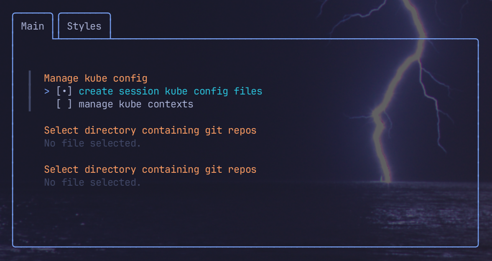
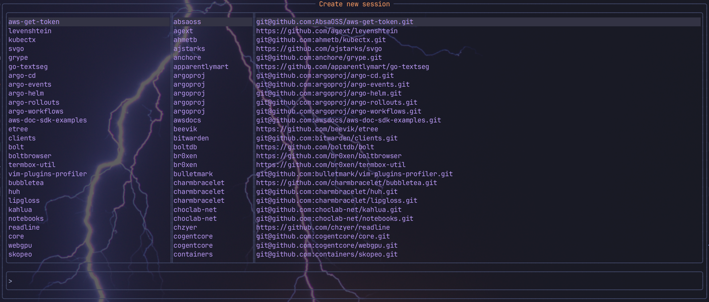
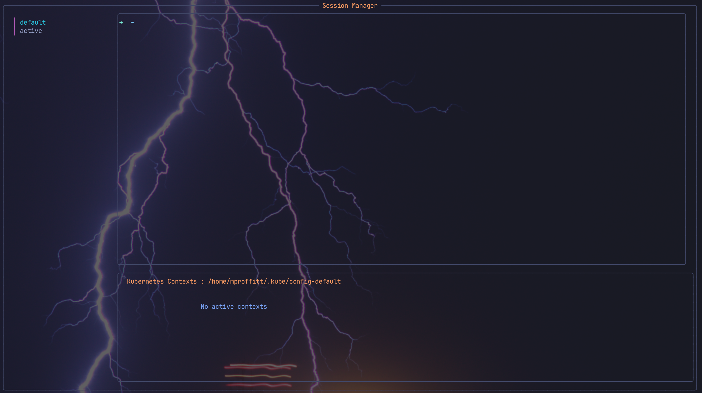
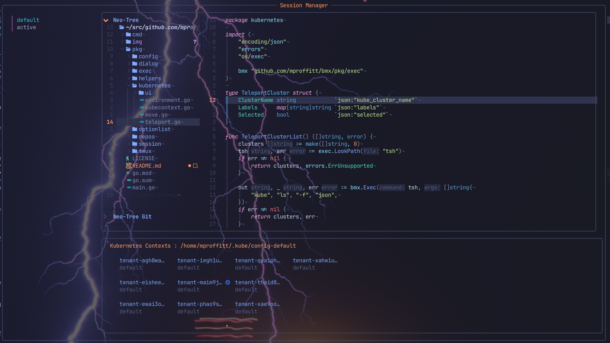
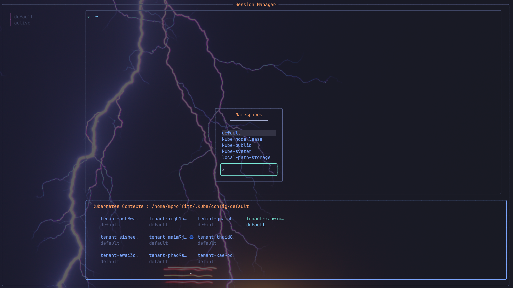
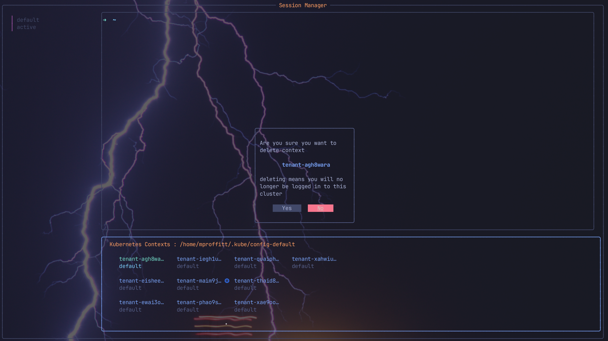
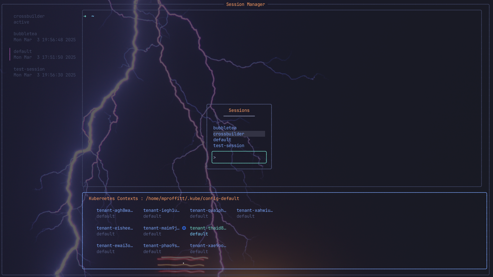
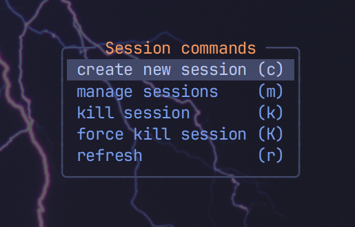

# BMX — Bubblemix based Tmux session manager for kubernetes

BubbleMux (bmx) is (yet another) tmux session manager, this time with built in
support for switching kubernetes config files based on the session, and
switching and managing contexts inside the current sessions kube-config.

## Features

- Quickly switch between tmux sessions
- Create new sessions from git repository paths
- Integrated, zoomable session preview
  - zoom in on up to the first 10 panes in a window
- Built in support for managing kubernetes config files
  - Per session kubeconfig files. Start each new session with a new, empty config
  - Easily set the current kubernetes context for the current session
  - Easily set the namespace for any available context
  - Delete individual clusters from the config
  - Move contexts from one kubeconfig to that of another session
  - Hide the context pane with shift+k
- Killing the session deletes the associated kubeconfig file
- Themeable. Starts with colours from `night/storm` from the `tokyo-night` theme

## Getting started

### Installation

I don't offer pre-built packages, Instead it can be built and
installed with

```sh
go build -o bmx . &&
install -m 750 bmx ~/bin/bmx
```

### First run

When you run `bmx` for the first time, the configuration needs to be created.

To help you with this, a ui will be shown to allow you to set the base configuration



- Use tab to switch between fields and space to select
- On the file-pickers, use the left and right arrow keys to navigate into the
  directory structure and enter to select a directory.
- Use `,` and `.` to switch between tabs
- Hit `esc` to exit the configuration process

The configuration will autosave to `${HOME}/.config/bmx/config.yaml`.

If you make a mistake or wish to change the configuration, edit this file or
restart the process with `bmx config`.

Within the configuration, there are two important settings to consider

1. `create session kube config files`
   If this setting is true, each new session will get its own kube config file
   named `config-<session_name>`. This file will last for the lifetime of the
   session and will be deleted when you delete the session either by using the
   `bmx kill` command or by deleting it through the session manager.

1. `manage kube contexts` If this is true, an additional context pane will be
   added below the preview pane. Here you will see all contexts discovered
   in the `kubeconfig` file. See [manage kube contexts] for details.

### Creating new sessions

There are three primary ways you may create new sessions with `bmx`

#### Via the command line

`bmx create sessionname` will create a new session with name `sessionname`.

From here it is also possible to set the base path for the session, and a
command to execute.

Session name may be split into 3 fields separated by a colon `:`. The second
parameter is the directory to use for the session, and the third is an
optional command.

If the command needs to contain spaces, quote the command. For example

```sh
bmx create ssh:/home/mproffitt/src:'ssh mproffitt@127.0.0.1'
```

The value of the command part of the session will then be stored as a TMUX
environment variable named `COMMAND` and can be re-exported into new windows or
panes within that session using `export $(tmux show-env COMMAND)`.

#### As a standalone UI

By executing `bmx create` without any arguments, by default it will open in a
floating popup window in the centre of the terminal.



If you do not wish to use the floating popup, pass the global flag `--no-popup`
(`-n`). In this instance the UI will take up the whole of the terminal.

#### Integrated to the session manager

Whilst inside the session manager, hit `ctrl+n` to bring up the new session
dialog.

### Creating arbitrary sessions

In its present form, BMX does not support creating fully configurable arbitrary
sessions, however there are two ways to achieve this from within the UI.

1. Enter a filter name in the `new session` dialog that does not match any
   git repository. In this instance, the session will be created and BMX
   will immediately switch to it, closing the UI on the original session.
1. When moving kubernetes contexts, enter a name that does not match an
   existing session. In this instance, the session will be created but will not
   be set as the active session.

### The session manager



To start the session manager, execute `bmx manage`. This will open the session
manager in a floating popup in the centre of the screen.

By default, it will be empty, a reflection mostly of what ever is on your
screen at the time.

To test the manager, here I create 10 kind clusters using random names as

```sh
for i in $(pwgen -1 -N 10 -A); do
    kind create cluster --name tenant-$i
done
```

Now if you open the session manager, you will see it populated more inline
with the below image.



Hit tab / shift+tab to move forward and back between panes.

### Context management

The current context is indicated by the presence of the kubernetes logo in the
left margin, with the contexts namespace being shown beneath the title.

In the above example, all contexts are in the `default` namespace.

Tab across to the context pane, then select a cluster and hit space to bring up
the namespace menu.



To change the active context, select one using the cursor keys, or `h`, `j`,
`k`, `l`, then hit `enter` to make that the new active context.

`del` and `x` can both be used to delete a context. If this is the case
you will be prompted before deletion to confirm.



### Logging in to clusters

If you use `teleport` to manage your clusters, it is possible to log in to new
clusters directly from the UI.

Hit `ctrl+l` to bring up the list of clusters known to teleport. From here the
list can be filtered to find the cluster you require.

> [!note]
>
> At present only `teleport` is supported.
>
> If you wish for another cluster authentication system to be supported, please
> provide example commands and output for `cluster list`, and the equivelant
> login commands

### Move contexts

If you accidentally log in to a cluster in the wrong session, you can move the
cluster to the relevant session kubeconfig file, or to an entirely new session
by pressing `m`. This will bring up a menu showing all available sessions from
which you can select the correct session.

To move to a new session entirely, type a non-matching name in the filter and
press `enter`



### Killing sessions

To kill a session, press `del` or `x` on the session you wish to delete.

This will present a confirmation dialog, the same as with moving contexts with
the only difference being that you cannot delete the active session.

If you wish to delete the active session, you can do so using the command line
tool `bmx kill`. This will also ask you to confirm. Force using `-f`

### Refresh

BMX comes with a built-in refresh capability.

This capability reloads all `tmux` config files, and sends the `KUBECONFIG`
variable to all known sessions, with the value set to the session name.

This is the same as running `tmux set-environment` manually, and likewise does
not automatically export that to active panes.

To for that, it is possible to have BMX attempt to do this automatically for you
by using the `send-keys` functionality.

> [!caution]
>
> The send keys functionality comes with a small amount of risk and therefore is
> placed behind the `--send-vars` flag rather than being used by default.
>
> For `send-keys` to work, it actively suspends any active process, writes to the
> terminal and then resumes the process.
>
> This may interfere with active processes that do not respond well to being
> resumed.

At present, only the following variables are sent if they are available:

- `KUBECONFIG` This is set to a value of `${HOME}/.kube/config-<session_name>`
- `COMMAND` Only available in certain circumstances. Not always re-sent.

## TMUX integration

To integrate `bmx` with TMUX, add the following to your `tmux.conf` file

```plaintext
unbind-key w
unbind-key o
bind-key o run-shell "bmx create"
bind-key w run-shell "bmx manage"
```

Alternatively a TMUX menu driven system is available via the `bmx menu`
command.



Bind this in a similar fashion to make it available.

### Shell integration

If you restart your system, even with plugins such as `tmux-ressurect`, the
environment is not preserved.

Add the following to the bottom of your `.bash_profile` or `.zshrc` file
to have BMX automatically set up the TMUX environment and ensure your
kubeconfig files are always loaded correctly.

```bash
# Autorun TMUX
# Keep this at bottom of script
if [ -z "${TMUX}" ]; then
  tmux new-session -d -s default
  session refresh
  tmux attach-session -t default
fi
export $(tmux show-env KUBECONFIG)
```

## Known Issues

If you find a bug, please feel free to raise an issue or pull request

## Supported platforms

- Linux

This might work on MAC as well, I've not tried. It definitely won't work on
Windows

## Roadmap

- Implement arbitrary session management
- Enable kube-context management to be run in standalone mode
- ~Scroll to view for active context~
- New session from cluster login (for now, you have to create the session first)
- ~Return to named session on session destroy~

## Out of scope

- Microsoft Windows support.
- Window / Pane management. This may make it into a release in the future
  but for now it's out of scope.
- Mouse support. This application needs about 10 keys to navigate.
